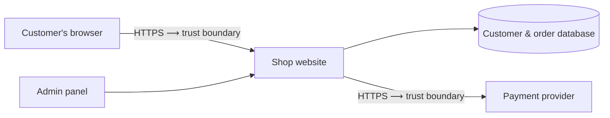

# 01: Threat model for an online shop

**The question:** If I were building a small online clothing shop, what could go wrong, and what would I fix first?

**Method:** STRIDE (Microsoft's threat checklist), with each threat scored as likelihood × impact.

---

## 1. What I'm protecting

- Customer accounts (logins and personal details)
- Payment details and transactions
- Order history and stock prices
- The website being available. If it's down, nobody can buy anything.

## 2. How the system fits together

The trust boundary is the line where data leaves the open internet and enters my system. Anything that crosses it is checked.

## 3. Finding the threats with STRIDE

| STRIDE | What it means | How it could happen here |
|---|---|---|
| **S**poofing | Pretending to be someone else | An attacker logs in as a customer using a password leaked from another site |
| **T**ampering | Changing data you shouldn't | Someone edits the basket so a £60 coat costs £1 |
| **R**epudiation | Denying you did something | A customer claims they never placed an order, and there are no logs to check |
| **I**nformation disclosure | Data leaking | Customer addresses are exposed because the database is set to public |
| **D**enial of service | Knocking the service offline | The site is flooded with traffic on Black Friday |
| **E**levation of privilege | Getting more access than you should | A normal customer gets into the admin panel |

## 4. Scoring and fixing

Risk = likelihood × impact, each scored from 1 (low) to 3 (high). I'd fix the highest scores first.

| Threat | L | I | Risk | Fix |
|---|---|---|---|---|
| Spoofing (stolen logins) | 3 | 3 | **9** | MFA on all accounts and a check for passwords known to have leaked |
| Information disclosure | 2 | 3 | **6** | Encrypt customer data, set storage to private, give access only to people who need it |
| Elevation of privilege | 2 | 3 | **6** | Least privilege, admin panel on its own login with MFA |
| Tampering (prices) | 2 | 2 | **4** | Check every price on the server, never trust prices sent from the browser |
| Denial of service | 2 | 2 | **4** | DDoS protection through a CDN, and extra capacity for peak days |
| Repudiation | 1 | 2 | **2** | Log orders and admin actions with timestamps |

*These scores are my own judgement for this example. A real business would agree them with its stakeholders.*

## 5. Checking the fixes

- An authorised penetration test before launch to confirm the fixes work
- Repeat the threat model whenever a new feature is added, e.g. gift cards or a mobile app

---

## What I took from this

- **The trust boundary helps the most.** Once it's drawn, it's clear where to check data.
- **Never trust the browser.** The price-tampering threat taught me this. Anything the customer's device sends can be changed.
- **The ambulance link.** Assessing a scene before treating a patient asks the same questions a threat model does: what's here, what could hurt us, and what do I deal with first.

**Other models I'd consider:** PASTA for a business-led risk view, or LINDDUN for privacy, which matters if the shop holds a lot of personal data.
