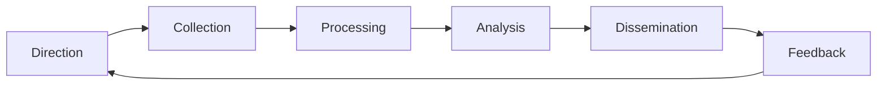

# 02: Threat intelligence needs for an online retailer

**The question:** What intelligence does an online clothing retailer need, and where would it get it?

**Why this business:** It sells directly to customers, handles a lot of payment data, and earns money only while its website is up. That makes it an attractive target.

---

## The threat intelligence lifecycle I followed

**Direction:** The question I set was: which attacks is this retailer most likely to face, and what does it need to know to stop them?

## Intelligence requirements

| Threat | Why it matters to this business | What the business needs to know | Where to get it |
|---|---|---|---|
| **Phishing** | Fake "your order is delayed" emails steal customer and staff logins | Live phishing campaigns, and lookalike websites copying the brand | NCSC alerts, brand monitoring, reports from customers |
| **Ransomware** | It can stop orders and deliveries completely, as in the 2025 attacks on UK retailers | Which ransomware groups target retail, and which vulnerabilities they use | NCSC and CISA advisories, MITRE ATT&CK |
| **DDoS** | Being knocked offline on Black Friday means lost sales | Malicious IP addresses and active botnets | GreyNoise, the hosting or CDN provider |
| **Malware / card skimming** | Code hidden in the checkout page can steal card details | IOCs such as file hashes and malicious domains | VirusTotal, threat feeds |

## Three levels of intelligence, and who uses each

| Level | Audience | Example for this retailer |
|---|---|---|
| **Strategic** | Directors | "Ransomware against UK retail is rising, so we need to fund offline backups." |
| **Tactical** | Security team | "This group gets in through phishing and then moves to the stock system." |
| **Operational** | Security tools | A list of malicious IP addresses to block today |

## The Pyramid of Pain

Blocking a file hash is easy, but an attacker can change the hash just as easily. It's much harder for them to change their tactics, techniques and procedures (TTPs). This is why intelligence about how a group works is worth more than a list of IOCs.

---

## What I took from this

- Intelligence is only useful if it helps someone make a decision. I started from what the business needed and found sources to answer that, instead of collecting everything.
- Source reliability matters. Bad intelligence causes false positives, where time is wasted on harmless activity, and false negatives, where real attacks are missed.
- The requirements should be reviewed regularly, because the threats change.
